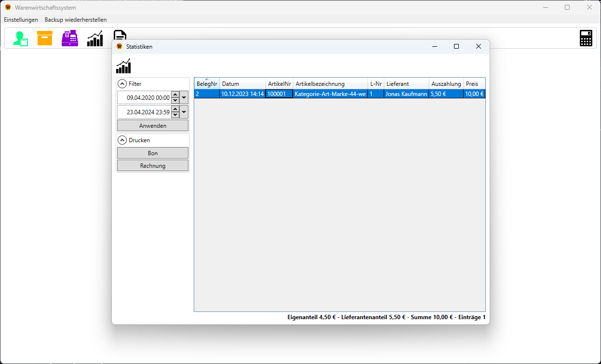

# Warenwirtschaftssystem (engl. Inventory Management System)

My parents run a second-hand store and were using a slow, and fundamentally broken inventory management system that slowed them down every day.
I decided to build a new and complete software from the ground up mostly 2018 in the 6 week school summer break.
It's based on C#, WPF (Windows Presentation Foundation), and Microsoft SQL Server.

This software is highly specialized to my parents' requirements and it's not built with the intention to be easily adoptable to other second-hand stores.
Feel free to use whatever you find helpful though.

I made this repository public mostly so that I can point to this project for applications.
It's also interesting to see my personal development in terms of code quality over time.

## Screenshots

